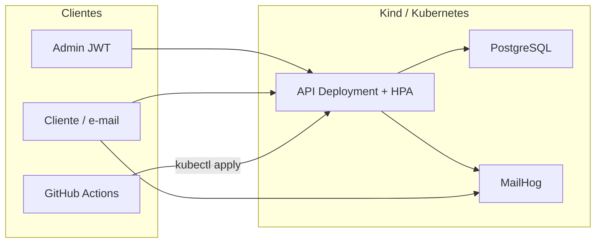

# WrenchBox API

Backend para gestão de oficinas mecânicas: ordens de serviço, clientes, veículos, catálogo, estoque e acompanhamento do cliente. Usa **Clean Architecture**, **testes automatizados**, **e-mail (MailHog)**, **Docker**, **Kubernetes**, **Terraform (Kind local)** e **CI/CD**.

## Arquitetura

Clean Architecture em camadas (o Domain não depende de Infrastructure):

| Projeto | Papel |
|---------|--------|
| `WrenchBox.Domain` | Entidades, value objects, regras e portas de persistência |
| `WrenchBox.Application` | Casos de uso (MediatR), DTOs, validação |
| `WrenchBox.Infrastructure` | Adaptadores: EF Core, PostgreSQL, JWT, SMTP |
| `WrenchBox.Api` | Adaptador HTTP: controllers, Swagger, health, webhooks |



Fluxo de deploy: testes → imagem Docker → Kind no CI (ou Terraform local) → apply de `/k8s` (banco + API + HPA).

## APIs de ordem de serviço

| Requisito | Endpoint |
|-----------|----------|
| Abertura de OS | `POST /api/v1/work-orders` — devolve `id` e `orderNumber` |
| Consulta de status | `GET /api/v1/work-orders/{id}/status` — `status` + `statusLabel` em português |
| Aprovação/recusa de orçamento | `POST /api/v1/tracking/work-orders/decision` `{ "approved": true\|false }` |
| Listagem operacional | `GET /api/v1/work-orders` — Execução > Aguardando Aprovação > Diagnóstico > Recebida; mais antigas primeiro; exclui Finalizada/Entregue |
| Status via e-mail | SMTP + MailHog; links no e-mail; `POST /api/v1/webhooks/work-order-status` |

Collection: [docs/WrenchBox.postman_collection.json](docs/WrenchBox.postman_collection.json)  
Swagger (local): http://localhost:8080/swagger  
Referência: [docs/api-endpoints.md](docs/api-endpoints.md)

## Execução local

Pré-requisitos: [.NET 8 SDK](https://dotnet.microsoft.com/download) e [Docker Desktop](https://www.docker.com/products/docker-desktop/).

```bash
cp .env.example .env
docker compose up --build
```

- API: http://localhost:8080
- Swagger: http://localhost:8080/swagger
- MailHog: http://localhost:8025
- Admin: `admin@wrenchbox.local` / `Admin@123`

```bash
docker compose up db mailhog -d
dotnet run --project src/WrenchBox.Api
```

Swagger em http://localhost:5000/swagger.

## Kubernetes

```bash
docker build -t wrenchbox:latest .
kind create cluster --name wrenchbox --config infra/kind-config.yaml
kind load docker-image wrenchbox:latest --name wrenchbox
kubectl apply -k k8s
kubectl -n wrenchbox get deploy,svc,hpa
```

API em http://localhost:8080 (NodePort 30080). MailHog em http://localhost:8025.

### HPA

```bash
kubectl -n wrenchbox get hpa -w
# em outro terminal
hey -z 60s -c 20 http://localhost:8080/api/v1/diagnostics/load
```

## Terraform

Provisiona o cluster Kind, o metrics-server e o PostgreSQL. Detalhes em [infra/README.md](infra/README.md).

```bash
cd infra
terraform init
terraform apply
cd ..
docker build -t wrenchbox:latest .
kind load docker-image wrenchbox:latest --name wrenchbox
kubectl apply -k k8s
```

## CI/CD

Pipeline em [.github/workflows/ci-cd.yml](.github/workflows/ci-cd.yml):

1. `dotnet restore` / `build` / `test`
2. `terraform init` + `terraform validate`
3. Build e push da imagem para GHCR (`main`)
4. Kind no runner: deploy do banco, apply dos manifestos (API/HPA), smoke em `/health`

## Produção (hardening)

Em `Production`, seed e Swagger ficam **desligados** por padrão (`Seed:Enabled`, `Swagger:Enabled`). O ambiente Kind de demonstração religa os dois via ConfigMap. Login tem rate limit (10 tentativas/minuto). A API envia `X-Content-Type-Options`, `X-Frame-Options` e `X-Request-Id`.

## Testes

```bash
dotnet test
```

Unitários (Domain/Application) e integração com Testcontainers (PostgreSQL). Meta: ≥ 80% de linhas em Domain e Application.
