# Documentação DDD — WrenchBox

Documentação completa de **Domain-Driven Design** do projeto **WrenchBox** — Sistema Integrado de Atendimento e Execução de Serviços para oficinas mecânicas.

Esta documentação segue a notação da disciplina de DDD e do **Event Storming** (Alberto Brandolini), com diagramas em Mermaid.

---

## Índice

1. [Visão do domínio](#1-visão-do-domínio)
2. [Linguagem Ubíqua](#2-linguagem-ubíqua)
3. [Design estratégico](#3-design-estratégico)
4. [Design tático](#4-design-tático)
5. [Event Storming — Ordem de Serviço](#5-event-storming--ordem-de-serviço)
6. [Event Storming — Peças e Insumos](#6-event-storming--peças-e-insumos)
7. [Mapeamento conceito → código](#7-mapeamento-conceito--código)
8. [Documentos relacionados](#8-documentos-relacionados)

---

## 1. Visão do domínio

### 1.1 Problema de negócio

Oficinas mecânicas precisam:

- Registrar atendimentos (cliente + veículo + serviços + peças).
- Calcular orçamentos automaticamente.
- Acompanhar o ciclo de vida da **Ordem de Serviço (OS)** em seis status.
- Permitir que o **cliente** consulte e **aprove** o orçamento sem login administrativo.
- Controlar **estoque** de peças com trilha de auditoria.
- Medir tempo médio de execução dos serviços.

### 1.2 Solução

Monólito em camadas com DDD:

| Camada | Projeto | Responsabilidade |
|--------|---------|------------------|
| Apresentação | `WrenchBox.Api` | REST, Swagger, JWT, middleware |
| Aplicação | `WrenchBox.Application` | Commands/Queries (MediatR), validação, DTOs |
| Domínio | `WrenchBox.Domain` | Entidades, Value Objects, regras de negócio |
| Infraestrutura | `WrenchBox.Infrastructure` | EF Core, PostgreSQL, repositórios, notificações |

### 1.3 Atores

| Ator | Papel | Autenticação |
|------|-------|--------------|
| **Administrador** | Cadastros, OS, estoque, métricas | JWT (`Authorization: Bearer`) |
| **Cliente** | Consulta e aprovação de orçamento | Token de acompanhamento (`X-Tracking-Token`) |
| **Sistema** | Número de OS, notificação, histórico | Interno |

---

## 2. Linguagem Ubíqua

A linguagem ubíqua é o vocabulário **compartilhado** entre negócio, documentação e código. Todo termo abaixo aparece com o mesmo significado na API, nos diagramas e nas entidades.

### 2.1 Glossário por contexto

#### Atendimento e Ordem de Serviço

| Termo (PT) | Código | Definição |
|------------|--------|-----------|
| Ordem de Serviço (OS) | `WorkOrder` | Registro formal de um atendimento na oficina |
| Número da OS | `OrderNumber` | Identificador legível (`WO-2026-00001`) |
| Status da OS | `WorkOrderStatus` | Estado no fluxo operacional (6 valores) |
| Orçamento | `TotalAmount` | Valor total = serviços + peças (snapshot de preços) |
| Token de Acompanhamento | `TrackingToken` | Chave única para o cliente consultar e aprovar |
| Diagnóstico | `StartDiagnosis` | Fase de análise do veículo antes do orçamento |
| Aprovação do Orçamento | `ApproveBudget` | Cliente autoriza execução; dispara baixa de estoque |
| Histórico de Status | `StatusHistory` | Auditoria de cada transição de status |
| Item de Serviço | `WorkOrderServiceItem` | Serviço na OS com quantidade e preço congelado |
| Item de Peça | `WorkOrderPartItem` | Peça na OS com quantidade e preço congelado |

#### Cadastro

| Termo (PT) | Código | Definição |
|------------|--------|-----------|
| Cliente | `Customer` | Pessoa física (CPF) ou jurídica (CNPJ) |
| Documento | `Document` | Value Object CPF/CNPJ validado |
| Veículo | `Vehicle` | Automóvel por placa, marca, modelo e ano |
| Placa | `Plate` | Value Object (legado ou Mercosul) |
| Serviço | `Service` | Item de mão de obra no catálogo |

#### Estoque

| Termo (PT) | Código | Definição |
|------------|--------|-----------|
| Peça / Insumo | `Part` | Item físico com SKU, preço e estoque |
| Estoque | `StockQuantity` | Quantidade disponível no depósito |
| Estoque Mínimo | `MinimumStock` | Limite de alerta para reposição |
| Movimentação de Estoque | `StockMovement` | Registro de entrada, saída ou ajuste |
| Ajuste de Estoque | `AdjustStock` | Correção manual (+/-) com motivo |
| Baixa de Estoque | `Deduct` | Saída automática na aprovação da OS |
| SKU | `Sku` | Código único da peça (uppercase) |

### 2.2 Status da Ordem de Serviço

```
Received → InDiagnosis → AwaitingApproval → InExecution → Completed → Delivered
```

| Valor API | Português | Significado |
|-----------|-----------|-------------|
| `Received` | Recebida | OS criada na recepção |
| `InDiagnosis` | Em diagnóstico | Oficina analisando o veículo |
| `AwaitingApproval` | Aguardando aprovação | Orçamento enviado ao cliente |
| `InExecution` | Em execução | Cliente aprovou; serviço em andamento |
| `Completed` | Finalizada | Serviço concluído; aguardando retirada |
| `Delivered` | Entregue | Veículo devolvido; ciclo encerrado |

### 2.3 Tipos de movimentação de estoque

| Valor API | Significado | Origem |
|-----------|-------------|--------|
| `Adjustment` | Ajuste manual | `PATCH /parts/{id}/stock` |
| `Deduction` | Baixa por OS | Aprovação do orçamento |
| `Release` | Liberação de reserva | Reservado para evolução futura |

> Glossário expandido: [linguagem-ubiqua.md](linguagem-ubiqua.md)

---

## 3. Design estratégico

### 3.1 Subdomínios

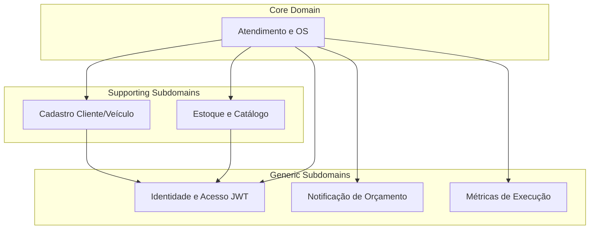

| Subdomínio | Classificação | Justificativa |
|------------|---------------|---------------|
| Atendimento e OS | **Core** | Diferencial: fluxo de status, orçamento, aprovação pelo cliente |
| Cadastro | Supporting | Padrão de mercado; necessário ao core |
| Estoque/Catálogo | Supporting | CRUD + movimentação; integrado na aprovação |
| Identidade (JWT) | Generic | Infraestrutura de segurança substituível |
| Notificação | Generic | Canal plugável (log → SMTP) |
| Métricas | Generic | Leitura agregada sobre OS finalizadas |

### 3.2 Bounded Contexts

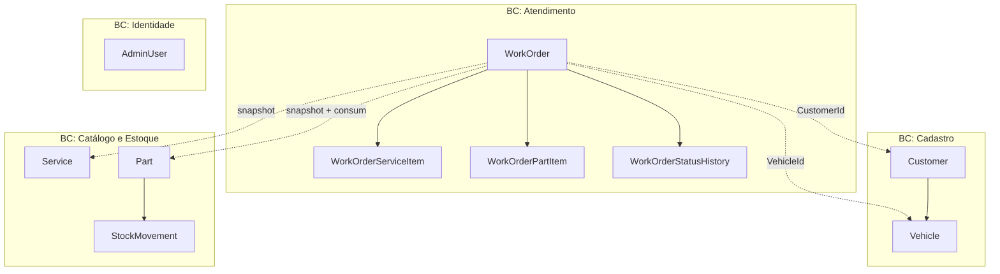

### 3.3 Context Map (relacionamentos entre contextos)

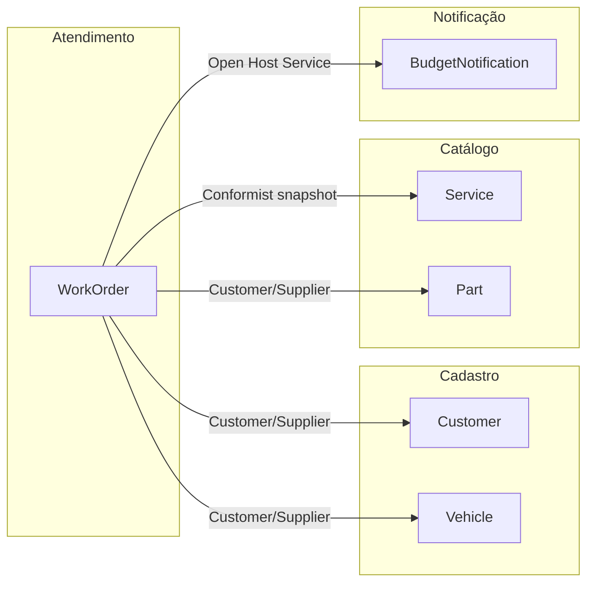

| De | Para | Padrão DDD | Descrição |
|----|------|------------|-----------|
| Atendimento | Cadastro | Customer/Supplier | OS referencia cliente e veículo por ID |
| Atendimento | Catálogo (serviços) | Conformist | Preços copiados na criação (snapshot) |
| Atendimento | Catálogo (peças) | Customer/Supplier | Snapshot na criação; consumo na aprovação |
| Atendimento | Notificação | Open Host Service | `IBudgetNotificationService` |

---

## 4. Design tático

### 4.1 Agregados e consistência

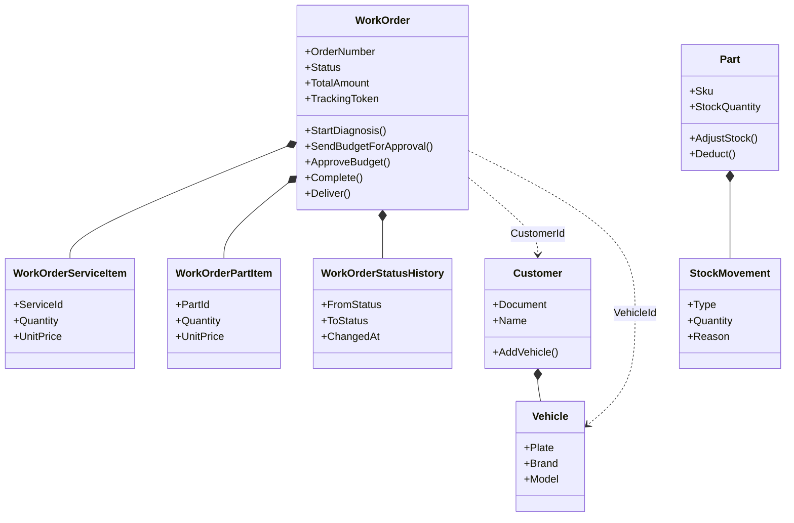

| Agregado | Raiz | Boundary transacional |
|----------|------|------------------------|
| Ordem de Serviço | `WorkOrder` | OS + itens + histórico |
| Cliente | `Customer` | Cliente + veículos (na criação da OS) |
| Peça | `Part` | Peça + movimentações |
| Serviço | `Service` | Entidade isolada |
| Administrador | `AdminUser` | Entidade isolada |

**Cross-aggregate:** `ApproveBudget` altera `WorkOrder` e múltiplos `Part` na mesma transação via `UnitOfWork`.

### 4.2 Value Objects

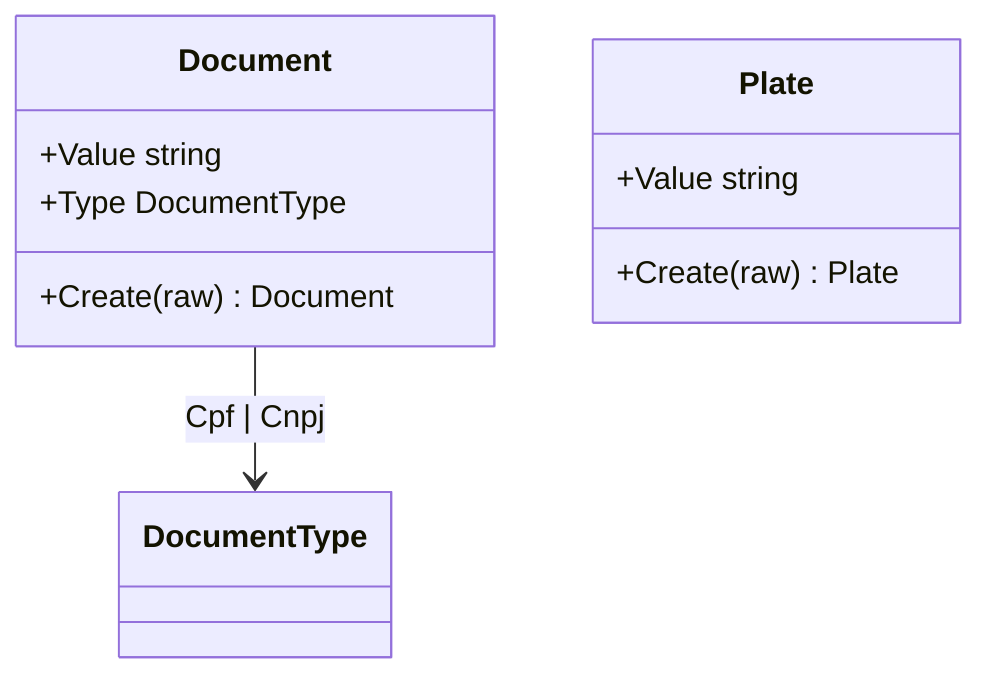

| Value Object | Imutável | Validação |
|--------------|----------|-----------|
| `Document` | Sim | CPF/CNPJ — dígitos verificadores |
| `Plate` | Sim | Legado (`ABC1234`) ou Mercosul (`ABC1D23`) |

### 4.3 Máquina de estados da OS

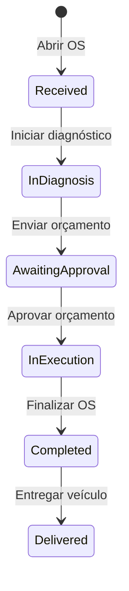

### 4.4 Camadas e padrões

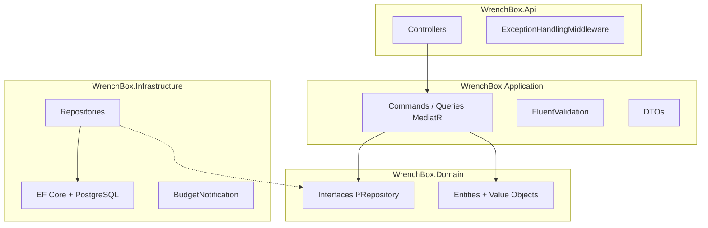

| Padrão | Onde |
|--------|------|
| CQRS (leve) | Commands mutam; Queries leem via MediatR |
| Repository | Abstração de persistência no domínio |
| Unit of Work | `SaveChangesAsync` transacional |
| Application Service | Handlers orquestram sem regra de negócio |
| Anti-corruption (leve) | Mappers `ToDto()`, `ToTrackingDto()` |

> Detalhes táticos: [modelagem-ddd.md](modelagem-ddd.md) · Regras: [logica-de-negocio.md](logica-de-negocio.md)

---

## 5. Event Storming — Ordem de Serviço

### 5.1 Legenda (notação da disciplina)

| Cor | Elemento | Significado |
|-----|----------|-------------|
| 🟧 Laranja | **Domain Event** | Fato irreversível que já aconteceu |
| 🟦 Azul | **Command** | Intenção de executar uma ação |
| 🟨 Amarelo | **Aggregate** | Consistência transacional / regras |
| 🟪 Roxo | **Policy** | Quando [evento], então [comando] |
| 🟩 Verde | **Read Model** | Visão para consulta |
| 🟥 Vermelho | **Hot Spot** | Ponto de decisão / incerteza |
| 👤 | **Actor** | Pessoa ou sistema externo |
| 📧 | **External System** | Sistema fora do domínio |

### 5.2 Big Picture — ciclo de vida da OS

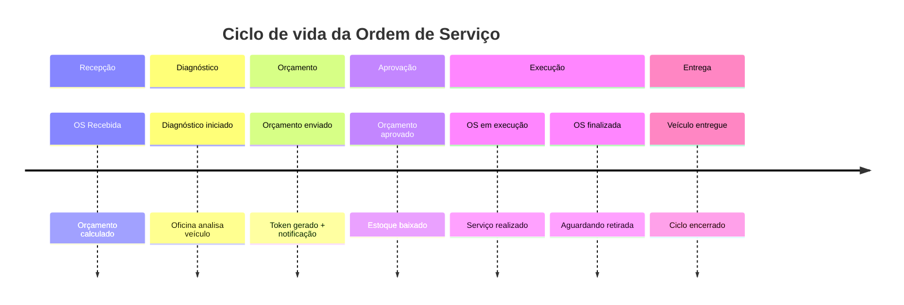

### 5.3 Mapa de processo completo

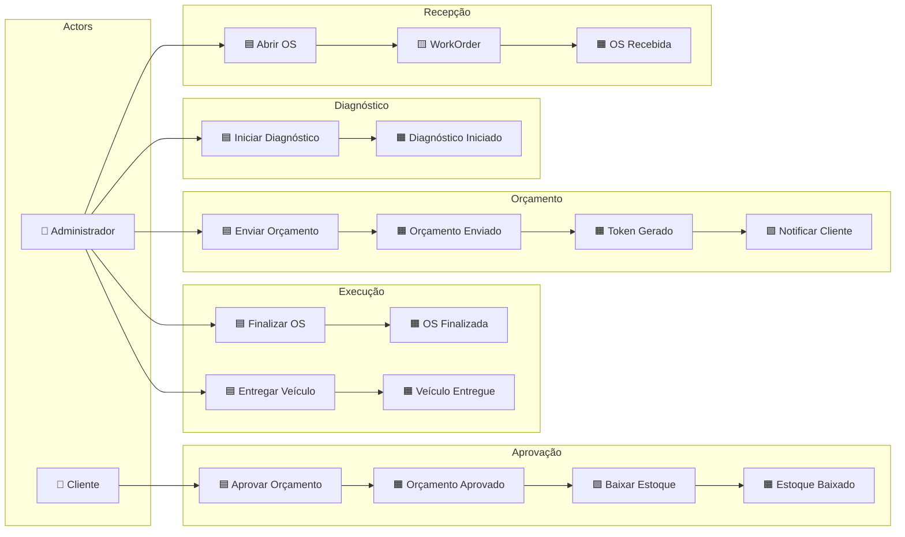

### 5.4 Process Level — fluxos detalhados

#### Fluxo A — Criação da OS

```
👤 Administrador
    │
    ▼
🟦 Comando: AbrirOrdemDeServiço
    │  (documento, veículo, serviços, peças opcionais)
    ▼
🟨 Aggregate: WorkOrder
    ├── 🟨 Customer (busca ou cria por documento)
    ├── 🟨 Vehicle (busca ou cria por placa)
    ├── Referência: Service[] (catálogo ativo)
    └── Referência: Part[] (catálogo ativo, opcional)
    │
    ├── 🟧 Evento: ClienteIdentificado
    ├── 🟧 Evento: VeículoVinculado
    ├── 🟧 Evento: ItensDeServiçoAdicionados
    ├── 🟧 Evento: ItensDePeçaAdicionados (opcional)
    ├── 🟧 Evento: OrçamentoCalculado
    └── 🟧 Evento: OrdemDeServiçoRecebida  ← status: Received
    ▼
🟩 Read Model: WorkOrderDto
```

| Policy | Gatilho | Ação |
|--------|---------|------|
| Identificar ou cadastrar cliente | Documento não encontrado | Criar `Customer` |
| Vincular ou cadastrar veículo | Placa não encontrada | Criar `Vehicle` |
| Rejeitar placa de terceiro | Placa de outro `CustomerId` | `DomainException` |
| Calcular orçamento | Itens adicionados | `RecalculateTotal()` |

| 🟥 Hot Spot | Decisão MVP |
|-------------|-------------|
| Mínimo de serviços? | Pelo menos 1 obrigatório |
| Baixa na criação? | Não — só na aprovação |
| Preço congelado? | Sim — snapshot nos itens |

#### Fluxo B — Diagnóstico

```
👤 Administrador
    ▼
🟦 Comando: IniciarDiagnóstico
    ▼
🟨 Aggregate: WorkOrder
    ▼
🟧 Evento: DiagnósticoIniciado       (Received → InDiagnosis)
🟧 Evento: StatusAlterado             (WorkOrderStatusHistory)
```

#### Fluxo C — Envio de orçamento

```
👤 Administrador
    ▼
🟦 Comando: EnviarOrçamento
    ▼
🟨 Aggregate: WorkOrder
    ├── 🟧 Evento: TokenDeAcompanhamentoGerado
    ├── 🟧 Evento: OrçamentoEnviado    (InDiagnosis → AwaitingApproval)
    └── 🟧 Evento: StatusAlterado
    ▼
🟪 Policy: Quando OrçamentoEnviado → NotificarCliente
    ▼
📧 External System: IBudgetNotificationService
    ▼
🟩 Read Model: SendBudgetResponseDto
```

#### Fluxo D — Acompanhamento pelo cliente

```
👤 Cliente  (header: X-Tracking-Token)
    ▼
🟦 Query: ConsultarOrdemDeServiço
    ▼
🟩 Read Model: TrackingWorkOrderDto
    (número, status, valor, itens, histórico — sem IDs internos)
```

#### Fluxo E — Aprovação do orçamento

```
👤 Cliente
    ▼
🟦 Comando: AprovarOrçamento
    ▼
🟨 Aggregate: WorkOrder
    │
    ├── 🟪 Policy: Para cada peça → BaixarEstoque
    │       ▼
    │   🟨 Aggregate: Part
    │       ▼
    │   🟧 Evento: EstoqueBaixado (StockMovement: Deduction)
    │
    ├── 🟧 Evento: OrçamentoAprovado    (AwaitingApproval → InExecution)
    └── 🟧 Evento: StatusAlterado
```

**Fluxo de falha (estoque insuficiente):**

```
🟦 AprovarOrçamento
    ✗ DomainException → OS permanece AwaitingApproval
    → 👤 Cliente contata oficina → reposição → nova tentativa
```

#### Fluxo F — Finalização e entrega

```
👤 Administrador
    ▼
🟦 Comando: FinalizarOrdemDeServiço  →  🟧 OS Finalizada (InExecution → Completed)
    ▼
🟦 Comando: EntregarVeículo          →  🟧 Veículo Entregue (Completed → Delivered)
```

---

## 6. Event Storming — Peças e Insumos

### 6.1 Big Picture — estoque

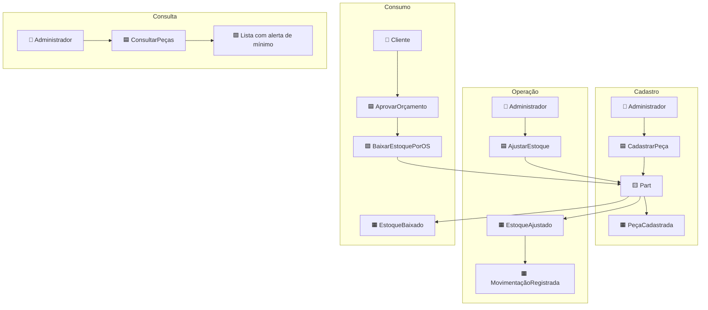

### 6.2 Process Level — fluxos detalhados

#### Fluxo 1 — Cadastro de peça

```
👤 Administrador
    ▼
🟦 Comando: CadastrarPeça
    ▼
🟨 Aggregate: Part
    ├── Valida: nome, SKU, preços ≥ 0, quantidades ≥ 0
    ├── SKU normalizado (uppercase)
    └── 🟧 Evento: PeçaCadastrada
    ▼
🟩 Read Model: PartDto (isBelowMinimumStock)
```

#### Fluxo 2 — Atualização cadastral

```
👤 Administrador
    ▼
🟦 Comando: AtualizarPeça
    ▼
🟨 Aggregate: Part
    ├── ⚠️ NÃO altera StockQuantity
    └── 🟧 Evento: PeçaAtualizada
```

**Decisão:** quantidade sempre via movimentação (`AdjustStock` ou `Deduct`) — trilha de auditoria.

#### Fluxo 3 — Ajuste manual de estoque

```
👤 Administrador / Estoquista
    ▼
🟦 Comando: AjustarEstoque (partId, quantityDelta, motivo)
    ▼
🟨 Aggregate: Part
    ├── Valida: delta ≠ 0; resultado ≥ 0
    ├── 🟧 Evento: EstoqueAjustado
    └── 🟧 Evento: MovimentaçãoRegistrada (Adjustment)
```

| Cenário | Delta | Motivo exemplo |
|---------|-------|----------------|
| Reposição | +50 | NF 12345 — fornecedor X |
| Perda/avaria | -3 | Peças danificadas no armazém |
| Inventário | -2 | Inventário cíclico jan/2026 |

#### Fluxo 4 — Baixa automática (aprovação de OS)

```
🟧 Evento upstream: OrçamentoAprovado (contexto Atendimento)
    ▼
🟪 Policy: BaixarEstoquePorOrdemDeServiço
    │  Para cada WorkOrderPartItem:
    ▼
🟨 Aggregate: Part.Deduct(quantidade, workOrderId)
    ├── 🟧 Evento: EstoqueBaixado
    └── 🟧 Evento: MovimentaçãoRegistrada (Deduction)
```

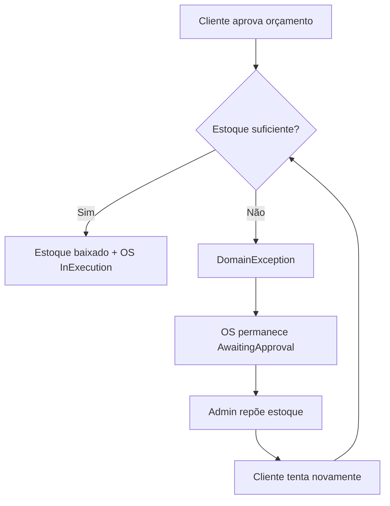

#### Fluxo 5 — Alerta de estoque mínimo

```
👤 Administrador
    ▼
🟦 Query: ListarPeças
    ▼
🟪 Policy de leitura: IsBelowMinimumStock()
    = StockQuantity < MinimumStock
    ▼
🟩 Read Model: PagedResult<PartDto> com isBelowMinimumStock
```

#### Fluxo 6 — Peça na OS (integração)

```
🟧 OrdemDeServiçoRecebida
    ├── WorkOrderPartItem criado (snapshot preço + SKU)
    ├── Orçamento recalculado
    └── Estoque NÃO alterado
```

### 6.3 Context Map — Estoque ↔ Atendimento

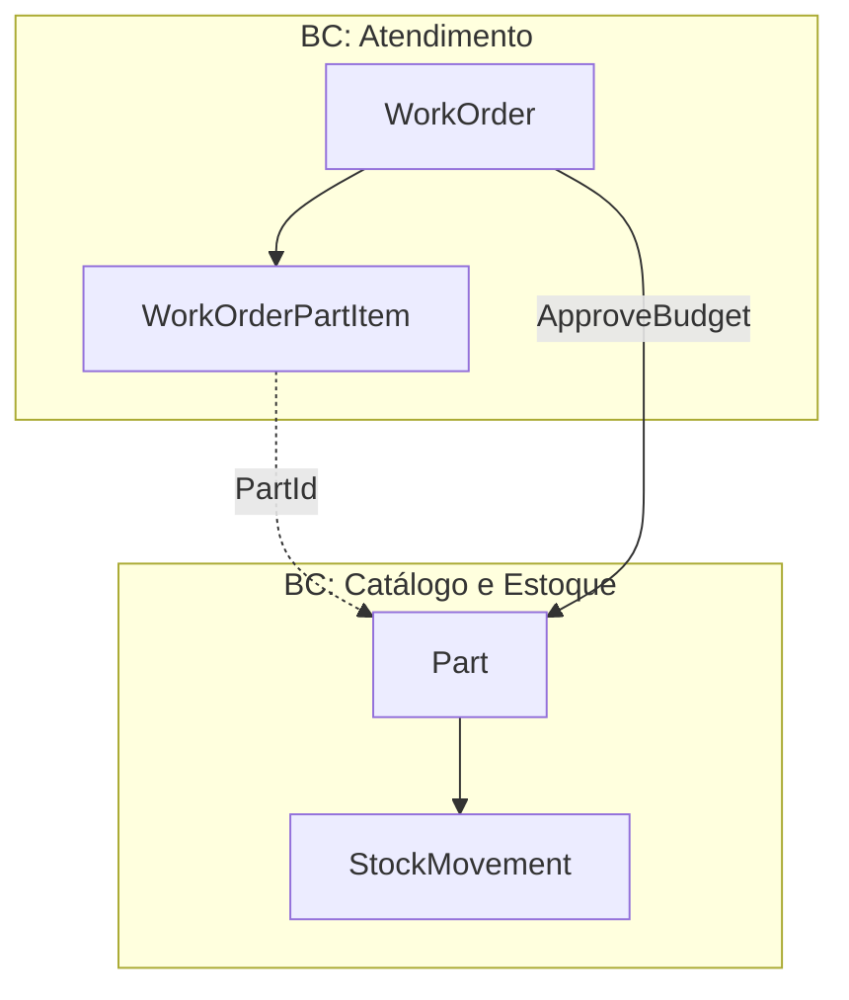

| 🟥 Hot Spot | MVP | Evolução |
|-------------|-----|----------|
| Reserva na OS | Não | Reservar ao enviar orçamento |
| Notificação de mínimo | Flag na API | Evento + e-mail ao gerente |
| Tipo Release | Enum sem uso | Liberar reserva cancelada |

> Workshop expandido: [event-storming-estoque.md](event-storming-estoque.md)

---

## 7. Mapeamento conceito → código

### 7.1 Eventos de domínio → implementação

| Evento (Ubíquo) | Código |
|-----------------|--------|
| OrdemDeServiçoRecebida | `WorkOrder.Create()` + status `Received` |
| DiagnósticoIniciado | `WorkOrder.StartDiagnosis()` |
| OrçamentoEnviado | `WorkOrder.SendBudgetForApproval()` |
| TokenDeAcompanhamentoGerado | `TrackingToken = Guid.NewGuid()` |
| NotificarCliente | `IBudgetNotificationService.SendBudgetApprovalRequestAsync()` |
| OrçamentoAprovado | `WorkOrder.ApproveBudget()` |
| EstoqueBaixado | `Part.Deduct()` |
| OrdemDeServiçoFinalizada | `WorkOrder.Complete()` |
| VeículoEntregue | `WorkOrder.Deliver()` |
| StatusAlterado | `RecordStatusChange()` → `WorkOrderStatusHistory` |
| PeçaCadastrada | `Part.Create()` |
| PeçaAtualizada | `Part.Update()` |
| EstoqueAjustado | `Part.AdjustStock()` |
| MovimentaçãoRegistrada | `StockMovement.Create()` |

### 7.2 Commands → API

| Command (Ubíquo) | Endpoint |
|------------------|----------|
| AbrirOrdemDeServiço | `POST /api/v1/work-orders` |
| IniciarDiagnóstico | `POST /api/v1/work-orders/{id}/start-diagnosis` |
| EnviarOrçamento | `POST /api/v1/work-orders/{id}/send-budget` |
| ConsultarOrdemDeServiço | `GET /api/v1/tracking/work-orders` |
| AprovarOrçamento | `POST /api/v1/tracking/work-orders/approve` |
| FinalizarOrdemDeServiço | `POST /api/v1/work-orders/{id}/complete` |
| EntregarVeículo | `POST /api/v1/work-orders/{id}/deliver` |
| CadastrarPeça | `POST /api/v1/parts` |
| AjustarEstoque | `PATCH /api/v1/parts/{id}/stock` |
| ConsultarPeças | `GET /api/v1/parts` |

### 7.3 Eventos de domínio (estado atual)

O MVP **não publica** `IDomainEvent` explícitos. Os fatos são inferidos por:

- Mudança de status + `WorkOrderStatusHistory`
- Registro de `StockMovement`
- Timestamps (`DiagnosisStartedAt`, `ApprovedAt`, `CompletedAt`, etc.)

Evolução natural: extrair `BudgetApprovedEvent` para desacoplar notificações e métricas.

---

## 8. Documentos relacionados

| Documento | Conteúdo |
|-----------|----------|
| [README da documentação](README.md) | Índice geral |
| [Linguagem Ubíqua](linguagem-ubiqua.md) | Glossário completo |
| [Lógica de Negócio](logica-de-negocio.md) | Invariantes e regras detalhadas |
| [Modelagem DDD](modelagem-ddd.md) | Camadas, padrões, sequência de aprovação |
| [Event Storming — Estoque](event-storming-estoque.md) | Workshop estoque expandido |
| [API — Endpoints](api-endpoints.md) | Referência REST completa |
| [Análise de Vulnerabilidades](analise-vulnerabilidades.md) | Revisão de segurança do MVP |

---

*WrenchBox — Tech Challenge SOAT · Arquitetura de Software · DDD + Event Storming*
