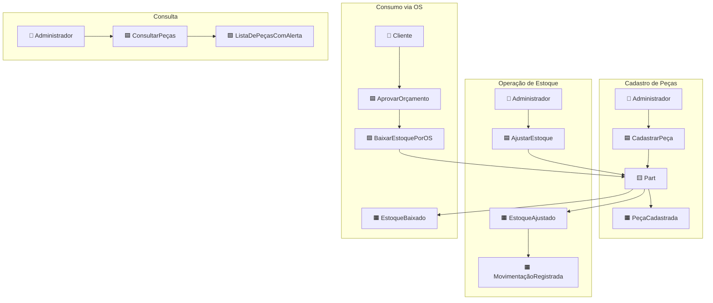
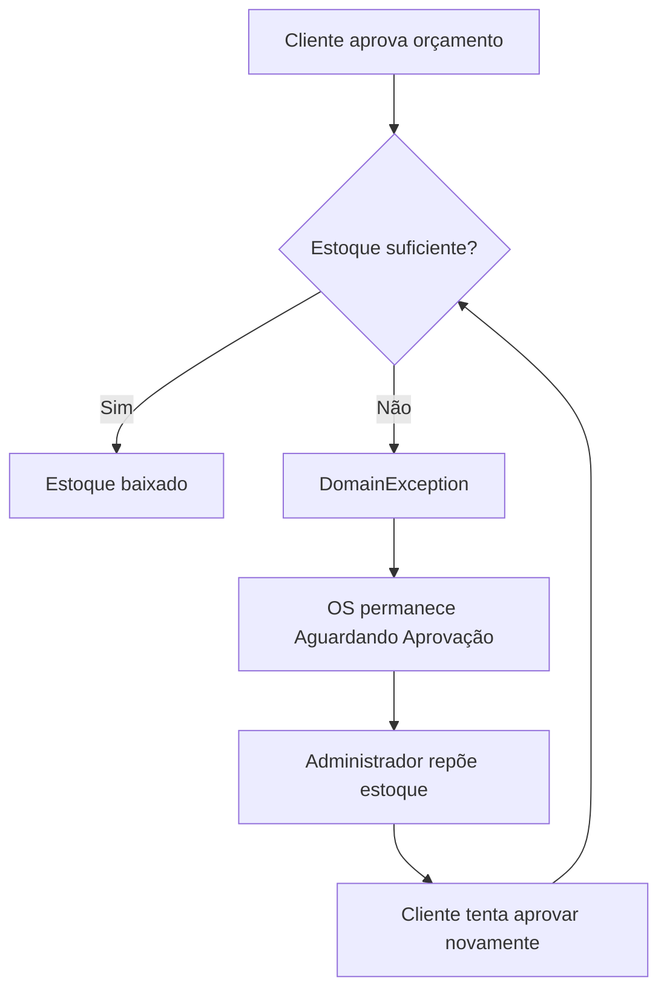
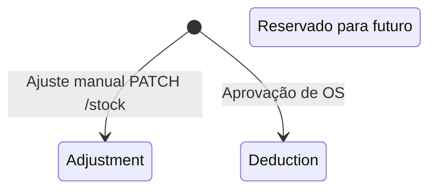
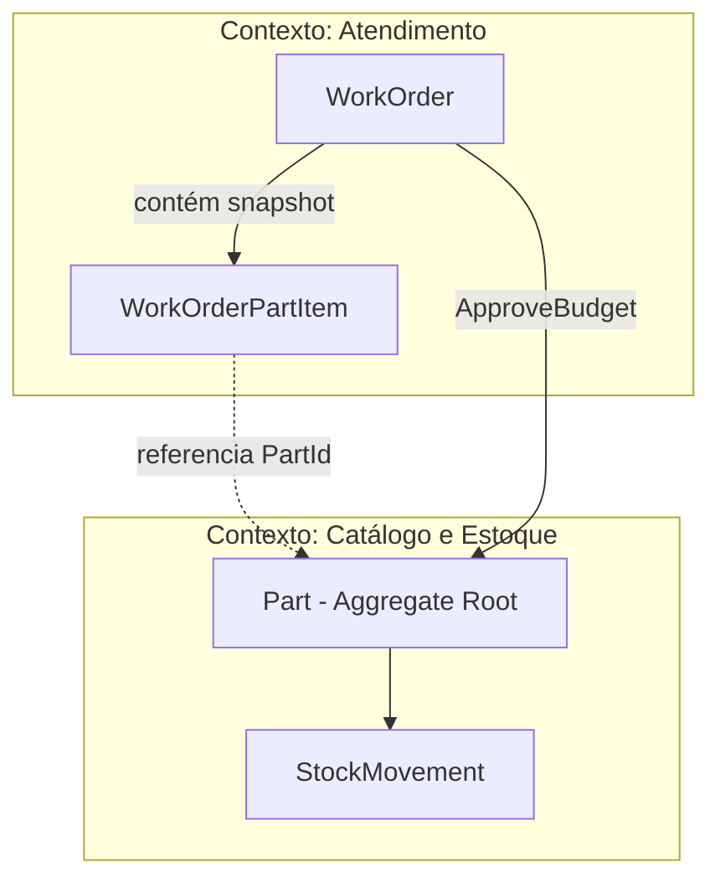
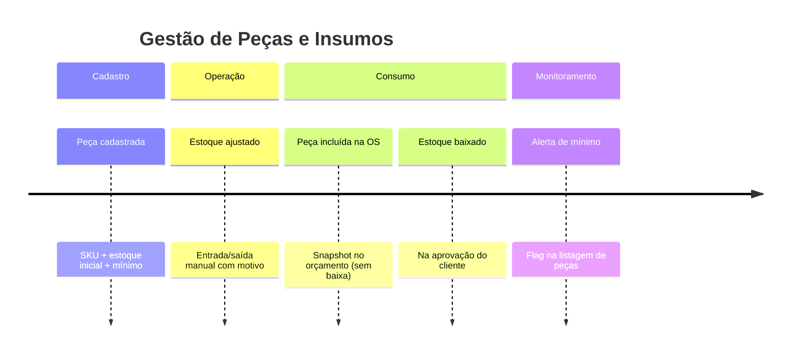

# Event Storming — Peças e Insumos

Workshop de descoberta de domínio para gestão de **peças, insumos e controle de estoque**.

## Legenda

| Símbolo | Elemento |
|---------|----------|
| 🟧 | Domain Event |
| 🟦 | Command |
| 🟨 | Aggregate |
| 🟪 | Policy |
| 🟩 | Read Model |
| 👤 | Actor |

---

## Visão Big Picture — Estoque



---

## Fluxo 1 — Cadastro de peça

### Narrativa

> **Quando** o administrador cadastra uma nova peça no catálogo, **então** o sistema registra SKU, preços, estoque inicial e estoque mínimo.

```
👤 Administrador
    ▼
🟦 Comando: CadastrarPeça
    │  (nome, sku, preço, estoqueInicial, estoqueMínimo)
    ▼
🟨 Aggregate: Part
    │
    ├── Valida: nome, sku, preços ≥ 0, quantidades ≥ 0
    ├── SKU normalizado (uppercase)
    └── 🟧 Evento: PeçaCadastrada
    ▼
🟩 Read Model: PartDto
    (inclui isBelowMinimumStock)
```

### Invariantes

| Regra | Detalhe |
|-------|---------|
| SKU único | Índice único no banco |
| Estoque inicial | Pode ser zero (peça cadastrada aguardando reposição) |
| Peça ativa por padrão | `IsActive = true` |

---

## Fluxo 2 — Atualização cadastral

```
👤 Administrador
    ▼
🟦 Comando: AtualizarPeça
    │  (nome, preço, estoqueMínimo, isActive)
    ▼
🟨 Aggregate: Part
    │
    ├── ⚠️ NÃO altera StockQuantity (separação de responsabilidades)
    └── 🟧 Evento: PeçaAtualizada
    ▼
🟩 Read Model: PartDto
```

**Decisão de design:** alteração de quantidade **sempre** passa por movimentação (`AdjustStock` ou `Deduct`), garantindo trilha de auditoria.

---

## Fluxo 3 — Ajuste manual de estoque

### Narrativa

> **Quando** o estoquista registra entrada ou saída manual (reposição, perda, inventário), **então** o sistema atualiza a quantidade e registra movimentação com motivo.

```
👤 Administrador / Estoquista
    ▼
🟦 Comando: AjustarEstoque
    │  (partId, quantidadeDelta, motivo)
    ▼
🟨 Aggregate: Part
    │
    ├── Valida: delta ≠ 0
    ├── Valida: estoqueResultante ≥ 0
    ├── Atualiza StockQuantity
    ├── 🟧 Evento: EstoqueAjustado
    └── 🟧 Evento: MovimentaçãoRegistrada (tipo: Adjustment)
    ▼
🟩 Read Model: PartDto atualizado
```

### Exemplos de uso

| Cenário | quantity | reason |
|---------|----------|--------|
| Reposicao de fornecedor | +50 | "NF 12345 - fornecedor X" |
| Perda/avaria | -3 | "Peças danificadas no armazém" |
| Correção de inventário | -2 | "Inventário cíclico jan/2026" |

---

## Fluxo 4 — Baixa automática (aprovação de OS)

### Narrativa

> **Quando** o cliente aprova o orçamento da OS, **então** para cada peça listada na OS o sistema deduz a quantidade reservada no orçamento.

```
🟧 Evento upstream: OrçamentoAprovado (contexto Atendimento)
    ▼
🟪 Policy: BaixarEstoquePorOrdemDeServiço
    │  Para cada WorkOrderPartItem:
    ▼
🟦 Comando implícito: DeduzirEstoque
    ▼
🟨 Aggregate: Part
    │
    ├── Valida: quantidade > 0
    ├── Valida: StockQuantity ≥ quantidade
    ├── Atualiza StockQuantity
    ├── 🟧 Evento: EstoqueBaixado
    └── 🟧 Evento: MovimentaçãoRegistrada (tipo: Deduction, workOrderId)
```

### Fluxo de falha



---

## Fluxo 5 — Alerta de estoque mínimo

### Narrativa

> **Quando** o administrador consulta o catálogo de peças, **então** o sistema indica quais itens estão abaixo do estoque mínimo configurado.

```
👤 Administrador
    ▼
🟦 Query: ListarPeças
    ▼
🟨 Aggregate: Part (consulta)
    │
    └── 🟪 Policy de leitura: IsBelowMinimumStock()
            = StockQuantity < MinimumStock
    ▼
🟩 Read Model: PagedResult<PartDto>
    (campo isBelowMinimumStock: true/false)
```

**Nota:** não há evento de domínio nem notificação push — apenas indicador na consulta (MVP).

---

## Fluxo 6 — Inclusão de peça na OS (contexto integrado)

Peças entram na OS **sem baixar estoque** na criação:

```
🟧 Evento upstream: OrdemDeServiçoRecebida
    │
    ├── WorkOrderPartItem criado (snapshot de preço e SKU)
    ├── Orçamento recalculado
    └── Estoque NÃO alterado ← decisão de negócio
```

**Rationale:** reserva física só na aprovação; evita bloqueio de estoque por orçamentos não aprovados.

---

## Tipos de movimentação



| Tipo | Origem | Quantidade | Vínculo OS |
|------|--------|------------|------------|
| `Adjustment` | `Part.AdjustStock()` | +/- delta | Não |
| `Deduction` | `Part.Deduct()` | negativo | Sim (`WorkOrderId`) |
| `Release` | — | — | Não implementado |

---

## Context Map — Estoque ↔ Atendimento



| Relação | Descrição |
|---------|-----------|
| **Atendimento → Catálogo** | Customer/Supplier na aprovação (consome estoque) |
| **Snapshot de preço** | Preço da peça congelado no item da OS |
| **Consistência** | Baixa e aprovação na mesma transação (`UnitOfWork`) |

---

## Timeline consolidada



---

## Mapeamento Evento → Código

| Evento (Ubíquo) | Implementação |
|-----------------|---------------|
| PeçaCadastrada | `Part.Create()` |
| PeçaAtualizada | `Part.Update()` |
| EstoqueAjustado | `Part.AdjustStock()` |
| EstoqueBaixado | `Part.Deduct()` |
| MovimentaçãoRegistrada | `StockMovement.Create()` |
| Alerta de mínimo | `Part.IsBelowMinimumStock()` → DTO |

---

## Hot Spots e evoluções futuras

| ⚠️ Hot Spot | Estado MVP | Evolução sugerida |
|-------------|------------|-------------------|
| Reserva de estoque na OS | Não implementado | Reservar ao enviar orçamento; liberar se rejeitado |
| Notificação de estoque baixo | Apenas flag na API | Evento `EstoqueAbaixoDoMínimo` + e-mail ao gerente |
| Tipo `Release` | Enum existe, sem uso | Liberar reserva cancelada |
| Peça inativa na OS | Bloqueado na criação | — |
| Inventário cíclico | Via ajuste manual | Fluxo dedicado de contagem |
