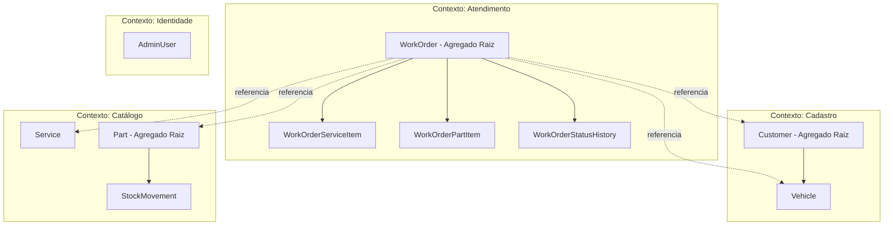
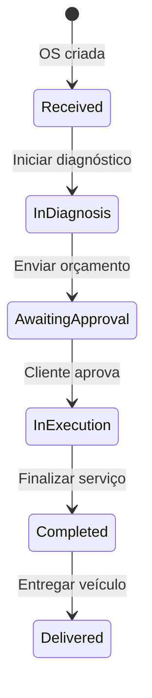

# Lógica de Negócio

Toda a lógica crítica reside na camada **Domain** (`WrenchBox.Domain`). A camada Application orquestra; a Infrastructure persiste.

---

## Bounded Contexts

---

## Agregado: Ordem de Serviço (`WorkOrder`)

**Raiz:** `WorkOrder`  
**Entidades filhas:** `WorkOrderServiceItem`, `WorkOrderPartItem`, `WorkOrderStatusHistory`

### Invariantes na criação

1. Pelo menos **um serviço** é obrigatório.
2. Serviços e peças referenciados devem estar **ativos** (`IsActive = true`).
3. O **orçamento total** é calculado automaticamente: soma de `(quantidade × preço unitário)` de serviços e peças.
4. Status inicial: **Recebida** (`Received`).
5. Número da OS gerado sequencialmente: `WO-{ano}-{sequência:5 dígitos}`.

### Máquina de estados

| Transição | Método de domínio | Pré-condição | Efeitos colaterais |
|-----------|-------------------|--------------|-------------------|
| → Em diagnóstico | `StartDiagnosis()` | Status = `Received` | Registra `DiagnosisStartedAt`; histórico |
| → Aguardando aprovação | `SendBudgetForApproval()` | Status = `InDiagnosis`; ≥1 serviço | Gera `TrackingToken`; registra `BudgetSentAt`; notificação ao cliente |
| → Em execução | `ApproveBudget()` | Status = `AwaitingApproval` | Baixa estoque das peças; `ApprovedAt`, `ExecutionStartedAt` |
| → Finalizada | `Complete()` | Status = `InExecution` | Registra `CompletedAt` |
| → Entregue | `Deliver()` | Status = `Completed` | Registra `DeliveredAt` |

**Regra:** toda transição inválida lança `DomainException` com mensagem explícita do status esperado vs. atual.

### Regras de orçamento e aprovação

- **Envio do orçamento:** gera token UUID (32 caracteres hex) e dispara `IBudgetNotificationService` com e-mail do cliente, número da OS, valor total e token.
- **Aprovação pelo cliente:** para cada peça na OS, executa `Part.Deduct(quantidade, workOrderId, motivo)`.
- **Estoque insuficiente na aprovação:** operação falha; OS permanece em `AwaitingApproval`.

### Regra auxiliar (não exposta na API)

- `CanModifyItems()` retorna `true` apenas em `Received` ou `InDiagnosis` — preparado para futura alteração de itens.

### Métricas

- `GetExecutionDuration()` = `CompletedAt - ExecutionStartedAt` (somente OS finalizadas entram na média).

---

## Agregado: Cliente (`Customer`)

**Raiz:** `Customer`  
**Entidades filhas:** `Vehicle` (via coleção)

### Regras

| Regra | Detalhe |
|-------|---------|
| Documento obrigatório | CPF (11 dígitos) ou CNPJ (14 dígitos) com validação de dígitos verificadores |
| E-mail normalizado | Convertido para minúsculas |
| Veículo por placa | Placa única no sistema; se já existe, deve pertencer ao mesmo cliente |
| Criação na OS | Se cliente não existe, é criado automaticamente na abertura da OS |

---

## Entidade: Veículo (`Vehicle`)

| Regra | Detalhe |
|-------|---------|
| Placa | Formato legado (`ABC1234`) ou Mercosul (`ABC1D23`) |
| Ano | Entre 1900 e ano corrente + 1 |
| Marca/modelo | Obrigatórios, não vazios |

---

## Agregado: Peça (`Part`)

**Raiz:** `Part`  
**Entidades filhas:** `StockMovement`

### Regras de estoque

| Operação | Regra |
|----------|-------|
| **Criação** | SKU único; estoque e mínimo ≥ 0; preço ≥ 0 |
| **Ajuste manual** | Quantidade ≠ 0; resultado ≥ 0; registra movimentação tipo `Adjustment` |
| **Baixa (dedução)** | Quantidade > 0; estoque suficiente; registra movimentação tipo `Deduction` vinculada à OS |
| **Alerta** | `IsBelowMinimumStock()` quando `StockQuantity < MinimumStock` |

**Importante:** a baixa de estoque ocorre **somente na aprovação do orçamento**, não na criação da OS.

---

## Entidade: Serviço (`Service`)

| Regra | Detalhe |
|-------|---------|
| Preço | ≥ 0 |
| Duração estimada | > 0 minutos |
| Inativo | Serviço inativo não pode ser incluído em nova OS |

---

## Value Objects

### `Document` (CPF/CNPJ)

- Remove caracteres não numéricos.
- Valida dígitos verificadores (algoritmo oficial).
- Rejeita sequências repetidas (ex.: `111.111.111-11`).

### `Plate`

- Normaliza para maiúsculas, remove hífen/espaço.
- Aceita padrão legado ou Mercosul.

---

## Regras da camada Application

| Fluxo | Regra adicional |
|-------|-----------------|
| Criar OS | Busca ou cria cliente por documento; busca ou cria veículo por placa |
| Placa de outro cliente | `AppException`: placa registrada para outro cliente |
| Serviços/peças inexistentes | `NotFoundException` |
| Autenticação | JWT com role `Admin` para rotas administrativas |
| Validação de entrada | FluentValidation antes do handler (CPF, CNPJ, placa, e-mail) |

---

## Políticas de persistência (Infrastructure)

- Repositórios `ForUpdate` carregam apenas entidades necessárias para mutação (evita conflitos EF).
- Após mutação, handlers recarregam agregado com includes para montar DTO completo.
- `SaveChanges` corrige entidades filhas com Guid gerado no cliente (`StatusHistory`, `StockMovement`) para estado `Added`.

---

## Notificação de orçamento

Implementação padrão: `SmtpNotificationService` (MailHog no ambiente local). A porta `INotificationService` permite trocar o provedor sem alterar o domínio.
