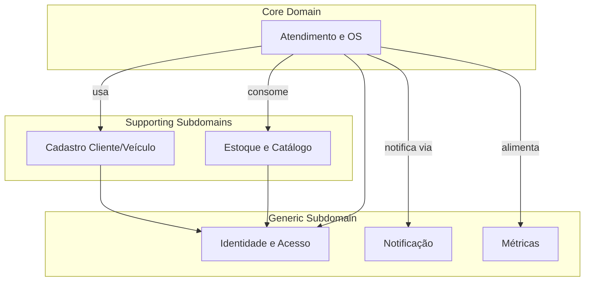
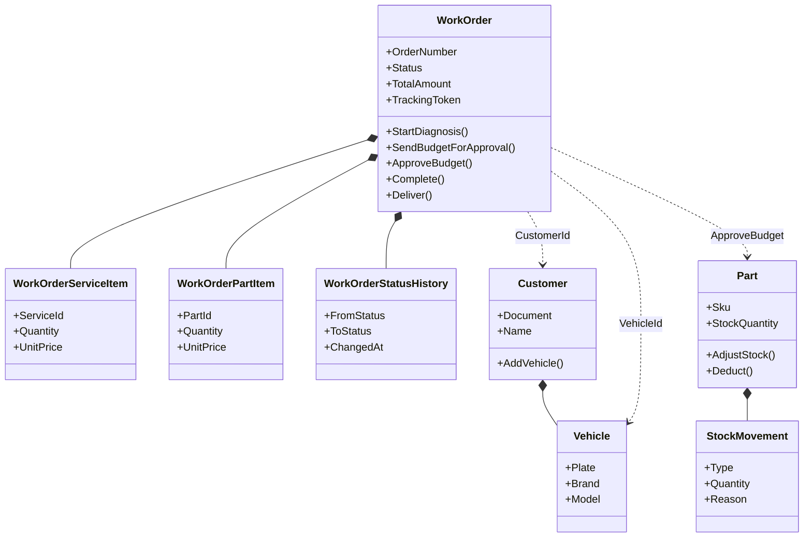
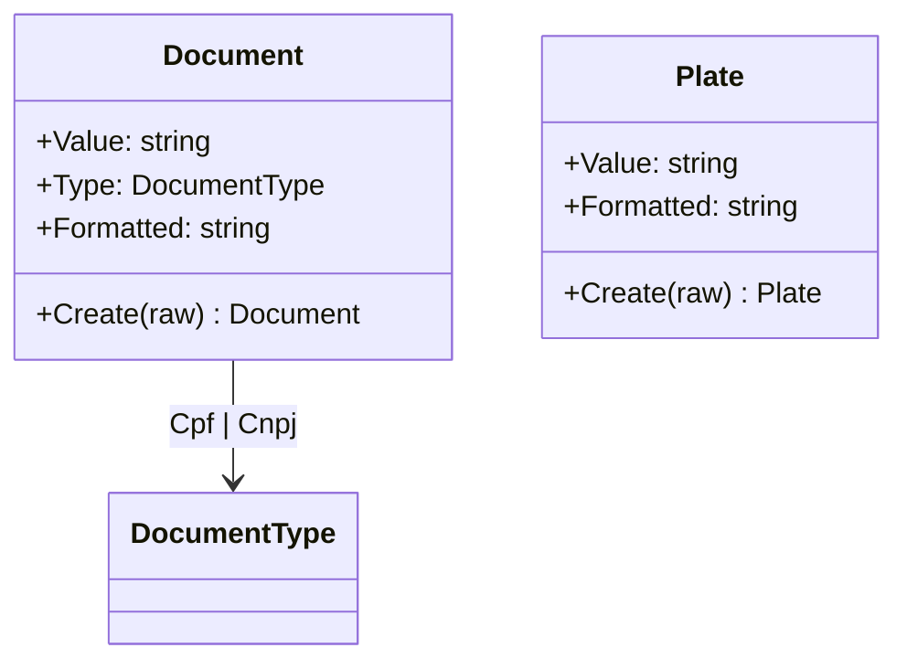
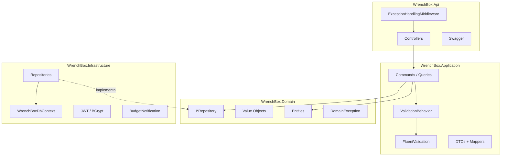
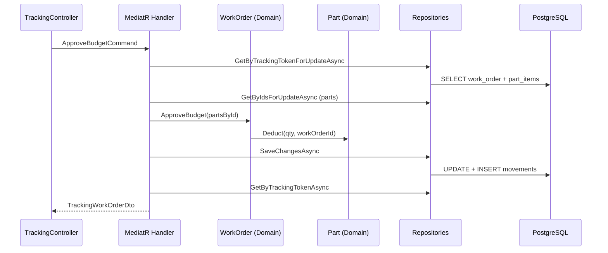
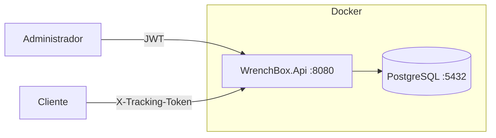

# Modelagem DDD

Documentação da arquitetura Domain-Driven Design aplicada ao WrenchBox.

---

## Estratégico — Context Map

| Subdomínio | Classificação | Justificativa |
|------------|---------------|---------------|
| **Atendimento e OS** | Core | Diferencial do negócio; fluxo de status, orçamento e aprovação |
| **Cadastro** | Supporting | Necessário, mas padrão de mercado |
| **Estoque/Catálogo** | Supporting | CRUD + movimentação; integrado ao core na aprovação |
| **Identidade (JWT)** | Generic | Infraestrutura de segurança |
| **Notificação** | Generic | Canal substituível (log → SMTP) |
| **Métricas** | Generic | Agregação de leitura sobre OS finalizadas |

---

## Tático — Agregados

### Diagrama de agregados

### Regras de consistência transacional

| Agregado | Boundary | Uma transação |
|----------|----------|---------------|
| `WorkOrder` | OS + itens + histórico | Sim |
| `Customer` | Cliente + veículos (criação) | Sim (na OS, parcial) |
| `Part` | Peça + movimentação | Sim |
| `Service` | Serviço isolado | Sim |
| `AdminUser` | Usuário isolado | Sim |

**Cross-aggregate:** `ApproveBudget` modifica `WorkOrder` e múltiplos `Part` na mesma transação via `UnitOfWork`.

---

## Value Objects

| Value Object | Imutável | Validação |
|--------------|----------|-----------|
| `Document` | Sim | CPF/CNPJ algoritmo oficial |
| `Plate` | Sim | Regex legado + Mercosul |

---

## Camadas e responsabilidades

| Camada | Pode referenciar | Não pode |
|--------|------------------|----------|
| Domain | — | Application, Infrastructure, Api |
| Application | Domain | Infrastructure (via interfaces) |
| Infrastructure | Domain, Application (interfaces) | — |
| Api | Application | Domain diretamente (idealmente) |

---

## Padrões aplicados

| Padrão | Onde | Descrição |
|--------|------|-----------|
| **CQRS (leve)** | Application | Commands mutam; Queries leem via MediatR |
| **Repository** | Domain/Infrastructure | Abstração de persistência |
| **Unit of Work** | Infrastructure | `SaveChangesAsync` transacional |
| **Domain Service (implícito)** | Domain entities | Lógica em `WorkOrder`, `Part` |
| **Application Service** | Handlers | Orquestração sem regra de negócio |
| **DTO** | Application | Contrato da API desacoplado do domínio |
| **Anti-corruption (leve)** | Mappers | `ToDto()`, `ToTrackingDto()` |

---

## Diagrama de sequência — Camadas na aprovação

---

## Ubiquitous Language no código

| Conceito de negócio | Namespace / tipo |
|---------------------|------------------|
| Ordem de Serviço | `WrenchBox.Domain.Entities.WorkOrder` |
| Status da OS | `WrenchBox.Domain.Enums.WorkOrderStatus` |
| Token de Acompanhamento | `WorkOrder.TrackingToken` |
| Orçamento | `WorkOrder.TotalAmount` |
| Baixa de estoque | `Part.Deduct()` |
| Movimentação | `StockMovement` |
| Notificação de orçamento | `IBudgetNotificationService` |

---

## Eventos de domínio (conceituais)

O MVP **não implementa** Domain Events explícitos (`IDomainEvent`). Os fatos de negócio são inferidos por:

- Mudança de status + `WorkOrderStatusHistory`
- `StockMovement` registrado
- Timestamps (`DiagnosisStartedAt`, `ApprovedAt`, etc.)

Evolução natural: extrair eventos como `BudgetApprovedEvent` para desacoplar notificações e métricas.

---

## Diagrama de implantação

---

## Referências cruzadas

- Vocabulário: [linguagem-ubiqua.md](linguagem-ubiqua.md)
- Regras detalhadas: [logica-de-negocio.md](logica-de-negocio.md)
- Event Storming (OS e estoque): [documentacao-ddd-completa.md](documentacao-ddd-completa.md)
- Event Storming Estoque: [event-storming-estoque.md](event-storming-estoque.md)
- Endpoints: [api-endpoints.md](api-endpoints.md)
